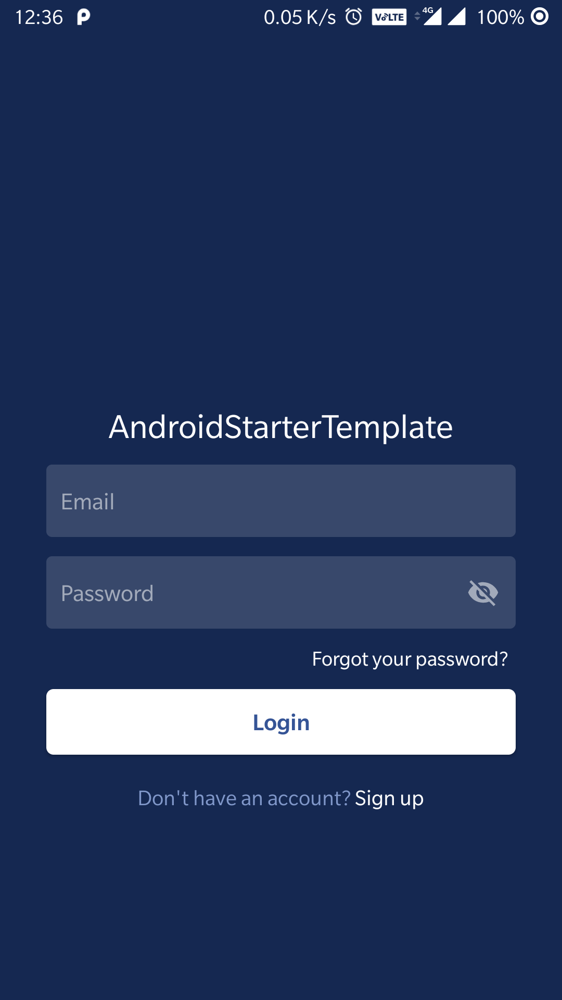

## android-starter-project
Initial Android Starter project for Android app development, to make development easy and fast🔋!

|                                                                | 
| ------------------------------------------------------------------------------- | 
|   |

## Prerequisites:

 - [Android Studio - 3.5.1](https://developer.android.com/studio/index.html) - The Official IDE for Android
 - [Java - 1.8](https://www.java.com/en/download/) - The Official Language for Android️
 - [Gradle build tools - 3.5.2 ](https://gradle.org/) - Build tool for Android Studio


## List of dependencies:

 - [Android Design Support](https://developer.android.com/reference/android/support/design/package-summary.html)
 - [ConstraintLayout](https://developer.android.com/reference/android/support/constraint/ConstraintLayout)
 - [Sdp Android](https://github.com/intuit/sdp)
 - [Firebase Crashlytics](https://firebase.google.com/docs/crashlytics)
 - [App Dependencies list](https://github.com/simformsolutions/android-starter-project/blob/master/settings/dependancies.gradle)

## Architecture used:
 - MVVM architecture, ViewModel and LiveData
 - Retrofit with Coroutines for Networking
 - [Koin](https://insert-koin.io/): A pragmatic lightweight dependency injection framework for Kotlin developers.
 - State management using State classes
 
### Static Code Analysis Tool
In this project, we have used eight different type of Static Code Analysis tools as listed below

    1.  CheckStyle
    2.  Lint
    3.  Findbugs
    4.  PMD
    5.  KtLint
    6.  Detekt
    7.  Spotless
 
### Permissions used

##### Automatically granted
* `INTERNET`: requires for accessing the internet.
* `ACCESS_NETWORK_STATE`: To check network state.

##### Requested only when needed
* `READ_EXTERNAL_STORAGE`: Requires for reading files from the external storage.
* `CAMERA`: Requires for supporting Camera image capture option.

## How to setup project?

1. Clone this repository in a location of your choice, like your projects folder, using this command  `"git clone <your-repo-url>"` over terminal.

2. Start **Android Studio** and go **File** -> **Open** select project folder.

3. It will take some time to build and download Gradle dependencies.

4. Once completed, there will be a message that says `"BUILD SUCCESSFUL"`.

5. Yup! You are all set now. To run just hit ► the (run) button.  🚀

### How to use?

There are four different `productflavors` available for running the project either in `development` or in `production` environment.

1. **Development** - Set the active Build Variant as `"developmentDebug"` to run the project in the Development environment.
2. **QA** - Set the active Build Variant as `"qaRelease"` to run the project in the Production environment.
3. **Client** - Set the active Build Variant as `"clientRelease"` to run the project in the Production environment.
4. **Production** - Set the active Build Variant as `"productionRelease"` to run the project in the Production environment.

```
  productFlavors {
        String baseUrlStage = "BASE_URL_STAGE"
        String baseUrlLive = "BASE_URL_LIVE"
        development {
            versionCode 1
            versionName "1.0-development"
            dimension "default"
            it.buildConfigField "String", "API_BASE_URL", "\"${project.properties[baseUrlStage]}\""
        }
        qa {
            versionCode 1
            versionName "1.0-qa"
            dimension "default"
            it.buildConfigField "String", "API_BASE_URL", "\"${project.properties[baseUrlStage]}\""
        }
        client {
            versionCode 1
            versionName "1.0-client"
            dimension "default"
            it.buildConfigField "String", "API_BASE_URL", "\"${project.properties[baseUrlStage]}\""
        }
        production {
            versionCode 1
            versionName "1.0-prod"
            dimension "default"
            it.buildConfigField "String", "API_BASE_URL", "\"${project.properties[baseUrlLive]}\""
        }
    }
```
## Define Base URLs
  - Replace your Stage and Live URL in [gradle.properties](https://github.com/simformsolutions/android-starter-project/blob/master/gradle.properties) File.

## Important credentials

- **Codacy**: developer@simformsolutions.com
- **Bitrise**: developer@simformsolutions.com
- **Firebase**:  developer@simformsolutions.com
